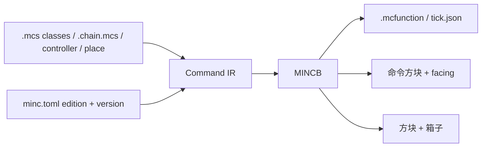

# MincScript language design

**This folder is the language contract.** The Rust compiler in `src/` implements it: tokenizer, parser, `minc check` / `minc build`, MINCB, and edition-specific command lowering. A buildable sketch is `examples/metro-escape/`.

MincScript is a **Java-shaped language that compiles to Minecraft**. A class is an in-world object. A field is a scoreboard (or a tag). Access modifiers are enforced by the compiler so gameplay state cannot be poked from arbitrary files. Each project has a config file that names the **edition** (Java or Bedrock) and the **game version**. Chain files are literally one command-block row (or stack). A controller file places those chains, sets their coordinates and connection style, and can also plant fixed blocks and chest contents. The compiler emits one **MINCB** binary that stores the whole machine.

Command syntax that comes out of the compiler must follow [`docs/minecraft-commands/`](../minecraft-commands/README.md). Bedrock and Java **do not share one AST**.

| Page | Contents |
| --- | --- |
| [01 Project config and CLI](01-project-and-cli.md) | `minc.toml`, `minc` subcommands |
| [02 Classes and scoreboards](02-classes-and-scoreboards.md) | Encapsulation, mangling, tags vs scores |
| [03 Syntax](03-syntax.md) | Java-like grammar, selectors, `as`/`at`, raw commands |
| [04 Chains, controller, world](04-chains-and-world.md) | One file = one CB sequence; layouts; chests |
| [05 MINCB and compilation](05-mincb-and-compile.md) | Unified binary, lowering, edition splits |
| [06 Syntax tutorial](06-tutorial.md) | Temps, `List.of`, one-command statements, Java vs Bedrock builtins |
| [Illustrative 地铁逃生](example-metro.md) | One small project in this syntax (not buildable yet) |



## Why this shape

Minecraft “code” is already there: dummy scores, tags, `/execute`, command blocks, functions. People who know Java should not have to invent name-mangled objectives by hand. The language does that, then **places** the result.

Three compilation products (one binary can hold all of them):

1. **Logic** — classes/methods → `.mcfunction` (and Bedrock `tick.json` / Java datapack `tick`) when `@Host(FUNCTION)`
2. **Machine** — `.chain.mcs` files → command blocks with facing, type, delay, coordinates
3. **Scenery** — `place` / `chest` → static blocks and container NBT

If you only emit functions and never attach a host, nothing runs. That is already documented in the Bedrock gameplay notes. The controller’s job is to make hosts explicit.

## Five-minute map for programmers

| You know | In MincScript | In the game (after compile) |
| --- | --- | --- |
| `class PlayerState { private int keys; }` | same | dummy objective, holder = that player |
| `p.keys += 1` inside the class | allowed | `scoreboard players add` |
| `p.keys += 1` in another class | **compile error** | (no command emitted) |
| `boolean extracted` | `private boolean extracted` | `/tag` (not a score) |
| `if (p.keys >= 1)` | `if` | `execute if score … matches 1..` |
| `for (Player p : players)` | `foreach` | `execute as` |
| `enum Phase { LOBBY, PLAY }` | `enum` | fake-player score on a world object |
| `package` | `pack metro.escape;` | namespace prefix |
| annotations | `@Repeat @AlwaysActive` | CB block type + Always Active |
| `Main` / Spring-style config | `controller.mcs` | where chains sit in the world |
| `.jar` | `.mincb` | edition-neutral placement blob |

There is **no heap**. You never `new` a player at runtime. `Player` values are selector handles. `new` exists only for compile-time descriptors (item stacks, regions, chain layouts).

## Source layout (one project)

```
metro-escape/
  minc.toml                 # edition + game version + origin
  src/
    controller.mcs         # 总控：链坐标、连接方式、世界方块
    logic/
      Phase.mcs
      Runner.mcs
    chains/
      Lobby.chain.mcs       # 文件 = 一条命令方块
      Play.chain.mcs
      Extract.chain.mcs
    world/
      Station.place.mcs     # 固定方块 + 箱子
```

## Non-goals for v1

- Generics (except builtin `Seq<T>` selectors and compile-time `List<T>`), inheritance beyond a single `extends`, interfaces
- A VM inside Minecraft (no custom bytecode interpreter in-game)
- Sharing one execute-walker between Java and Bedrock
- Education Edition `/agent`

v1 is: Java-like classes + scoreboard privacy + chains + controller + MINCB + CLI.
